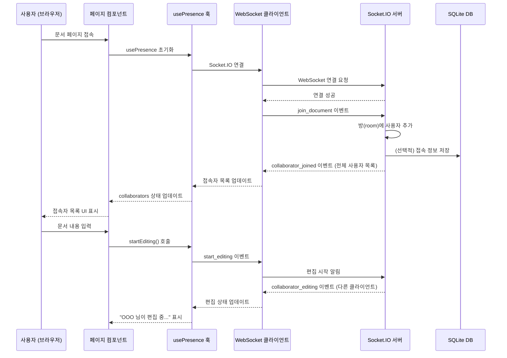
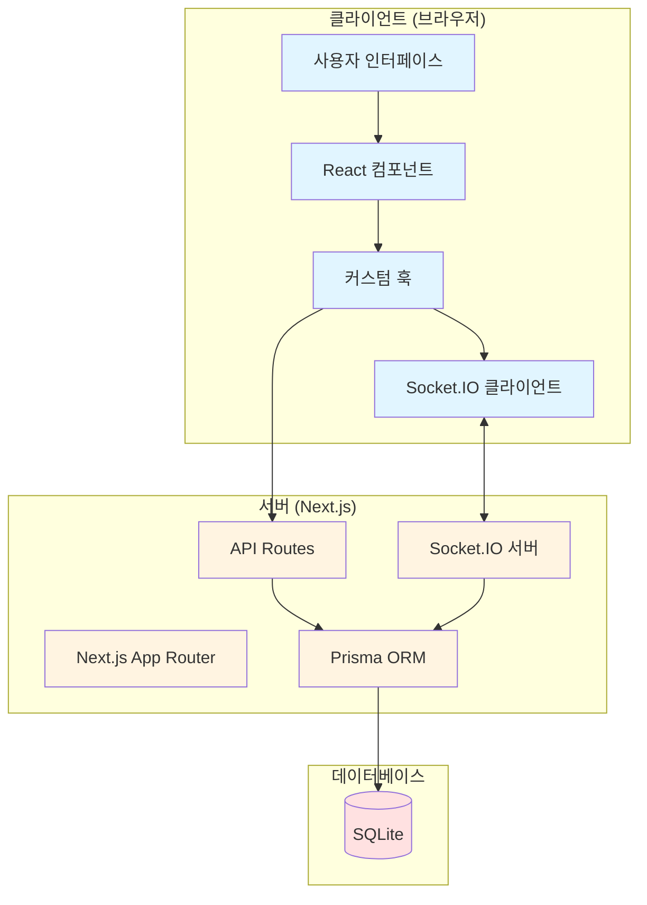

# 실시간 협업 문서 편집기

Notion 스타일의 실시간 협업 문서 편집기입니다. 여러 사용자가 동시에 문서를 편집하고, 누가 접속 중인지, 누가 편집 중인지를 실시간으로 확인할 수 있으며, 변경 이력을 타임라인으로 볼 수 있습니다.

## 주요 기능

- ✅ 실시간 협업 편집: 여러 사용자가 동시에 같은 문서를 편집할 수 있습니다
- ✅ 접속자 표시: 현재 문서에 접속 중인 사용자 목록을 실시간으로 확인할 수 있습니다
- ✅ 편집 상태 표시: 누가 현재 편집 중인지 실시간으로 확인할 수 있습니다
- ✅ 자동 저장: 문서 내용과 제목이 자동으로 저장됩니다
- ✅ 타임라인 기능: 누가 어디를 어떻게 수정했는지 변경 이력을 타임라인으로 확인할 수 있습니다
- ✅ 타임라인 클릭: 타임라인 항목을 클릭하면 해당 위치로 자동 스크롤됩니다

## 기술 스택

- **프론트엔드/백엔드**: Next.js 14 (App Router, TypeScript)
- **스타일링**: Tailwind CSS
- **데이터베이스**: Prisma + SQLite
- **실시간 통신**: Socket.IO
- **언어**: TypeScript

## 필요 환경

- Node.js 18 이상
- npm 또는 yarn

## 설치 방법

1. 프로젝트 클론 또는 다운로드

2. 의존성 설치:
```bash
npm install
```

3. 환경 변수 설정:
`.env` 파일을 생성하고 다음 내용을 추가하세요:
```
DATABASE_URL="file:./prisma/dev.db"
```

4. 데이터베이스 초기화:
```bash
npx prisma migrate dev --name init
```
또는
```bash
npx prisma db push
```

## 실행 방법

### 개발 모드

```bash
npm run dev
```

서버가 시작되면 브라우저에서 `http://localhost:3000`으로 접속하세요.

### 프로덕션 빌드

```bash
npm run build
npm start
```

## 사용 방법

### 1. 첫 접속

1. 브라우저에서 `http://localhost:3000`으로 접속합니다
2. 닉네임을 입력하고 "문서 목록으로 이동" 버튼을 클릭합니다
3. 닉네임은 localStorage에 저장되어 다음 접속 시 자동으로 사용됩니다

### 2. 문서 생성 및 편집

1. 문서 목록 페이지에서 "새 문서 만들기" 버튼을 클릭하여 새 문서를 생성합니다
2. 문서를 클릭하면 편집 화면으로 이동합니다
3. 상단의 제목 입력 필드에서 문서 제목을 수정할 수 있습니다 (자동 저장)
4. 본문 영역에서 문서 내용을 편집할 수 있습니다 (자동 저장 및 실시간 동기화)

### 3. 실시간 협업 테스트

1. **첫 번째 브라우저/탭**:
   - 닉네임을 입력하고 문서를 엽니다
   - 예: 닉네임 "사용자1"

2. **두 번째 브라우저/시크릿 창**:
   - 다른 닉네임으로 접속합니다
   - 예: 닉네임 "사용자2"
   - 같은 문서를 엽니다

3. **실시간 동기화 확인**:
   - 한 브라우저에서 텍스트를 입력하면 다른 브라우저에서도 실시간으로 반영됩니다
   - 상단에 접속 중인 사용자 목록이 표시됩니다
   - 누가 편집 중인지 "OOO 님이 편집 중..." 메시지가 표시됩니다

### 4. 타임라인 기능 사용

1. 문서 편집 화면의 우측에 타임라인 패널이 표시됩니다
2. 문서를 편집하면 자동으로 변경 이력이 타임라인에 추가됩니다
3. 타임라인 항목을 클릭하면 해당 위치로 자동 스크롤되고 하이라이트됩니다
4. 타임라인에는 다음 정보가 표시됩니다:
   - 수정한 사용자 이름
   - 수정 시간
   - 수정된 줄 번호
   - 수정 내용 요약

## 시스템 아키텍처

### 시퀀스 다이어그램

#### 1. 사용자 접속 및 문서 편집 흐름



#### 2. 전체 시스템 아키텍처



## 프로젝트 구조

```
hackServer/
├── app/                    # Next.js App Router 페이지
│   ├── api/               # API 라우트
│   │   ├── documents/     # 문서 CRUD API
│   │   └── edit-logs/     # 편집 로그 API
│   ├── docs/              # 문서 관련 페이지
│   │   ├── page.tsx       # 문서 목록
│   │   └── [id]/          # 문서 편집 페이지
│   ├── layout.tsx         # 루트 레이아웃
│   ├── page.tsx           # 홈 페이지 (닉네임 입력)
│   └── globals.css        # 전역 스타일
├── components/            # React 컴포넌트
│   ├── DocumentEditor.tsx # 문서 편집기
│   ├── Timeline.tsx       # 타임라인 패널
│   └── UserList.tsx       # 사용자 목록
├── lib/                   # 유틸리티 및 훅
│   ├── hooks/             # 커스텀 훅
│   │   ├── usePresence.ts      # 접속자 관리 훅
│   │   ├── useDocumentSync.ts  # 문서 동기화 훅
│   │   └── useTimeline.ts      # 타임라인 훅
│   ├── prisma.ts          # Prisma 클라이언트
│   ├── types.ts           # TypeScript 타입 정의
│   └── websocket.ts       # Socket.IO 서버 설정
├── prisma/                # Prisma 설정
│   └── schema.prisma      # 데이터베이스 스키마
├── server.ts              # 커스텀 서버 (Socket.IO 포함)
├── package.json           # 프로젝트 설정
├── tsconfig.json          # TypeScript 설정
├── tailwind.config.ts     # Tailwind CSS 설정
└── README.md              # 프로젝트 문서
```

## 데이터베이스 스키마

### Document (문서)
- `id`: 문서 고유 ID
- `title`: 문서 제목
- `content`: 문서 내용
- `updatedAt`: 마지막 수정 시간

### EditLog (편집 로그)
- `id`: 로그 고유 ID
- `documentId`: 문서 ID (외래키)
- `userName`: 수정한 사용자 닉네임
- `lineNumber`: 수정된 줄 번호
- `summary`: 수정 내용 요약
- `createdAt`: 생성 시간

## 주요 기능 상세

### 실시간 동기화
- Socket.IO를 사용하여 WebSocket 연결을 통해 실시간 통신
- 문서 내용 변경 시 다른 클라이언트로 즉시 브로드캐스트
- 디바운스를 사용하여 과도한 네트워크 요청 방지

### 접속자 관리
- 문서별로 방(room) 개념을 사용하여 접속자 관리
- 사용자별 고유 색상 자동 할당
- 접속/퇴장 이벤트 실시간 브로드캐스트

### 편집 상태 표시
- 사용자가 입력을 시작하면 "편집 중" 상태로 표시
- 일정 시간 입력이 없으면 자동으로 편집 중지 상태로 변경

### 타임라인 기능
- 문서 편집 시 자동으로 편집 로그 생성
- 엔터, 마침표 등 의미 있는 변경 시점에 로그 기록
- 같은 줄에서 짧은 시간 내 여러 수정은 중복 방지
- 최근 50개의 편집 로그를 타임라인에 표시

## 문제 해결

### 데이터베이스 오류
- Prisma 클라이언트가 생성되지 않은 경우: `npx prisma generate` 실행
- 마이그레이션 오류: `npx prisma migrate reset` 후 다시 마이그레이션

### Socket.IO 연결 오류
- 서버가 정상적으로 실행되었는지 확인
- 브라우저 콘솔에서 WebSocket 연결 상태 확인
- 방화벽 설정 확인

### 실시간 동기화가 작동하지 않는 경우
- 두 브라우저가 같은 문서를 열었는지 확인
- 브라우저 콘솔에서 에러 메시지 확인
- 서버 로그에서 Socket.IO 이벤트 확인

## 라이선스

이 프로젝트는 교육 목적으로 제작되었습니다.

## 기여

버그 리포트나 기능 제안은 이슈로 등록해주세요.

